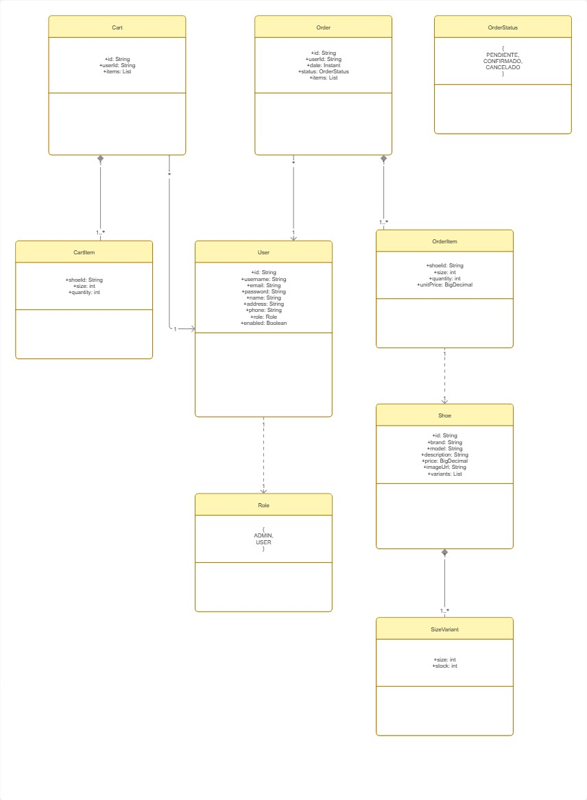

# 🏀 BasquetStore API

API RESTful para gestión de venta de zapatillas de básquet, desarrollada con **Spring Boot** y **MongoDB**.  
Incluye autenticación JWT, roles de usuario (USER/ADMIN), carrito de compras, gestión de pedidos con estados, control de stock por talle y endpoints paginados/filtrados.

## 🚀 Tecnologías
- Java 17 / 21
- Spring Boot 3.x
- Spring Data MongoDB
- Spring Security + JWT (JJWT)
- MongoDB
- Swagger / OpenAPI 3 / ThunderClient
- Maven

## ✨ Funcionalidades
- Registro y login con tokens JWT
- Roles: USER y ADMIN
- Usuarios con datos de perfil (nombre, dirección, teléfono)
- Productos (zapatillas) con 4 marcas, 4 modelos por marca, talles 39 al 42 y stock independiente por talle
- Listado público de productos con paginación y filtros por marca y talle
- Carrito de compras asociado a cada usuario (agregar, modificar, eliminar items)
- Checkout: creación de pedidos a partir del carrito, con descuento de stock
- Pedidos con estados: PENDIENTE, CONFIRMADO, CANCELADO
- Reposición de stock al cancelar
- Visualización de pedidos: USER ve los propios, ADMIN ve todos
- Cambio de estado de pedidos (solo ADMIN)
- Documentación interactiva con Swagger UI

## 🧱 Arquitectura
El proyecto sigue una arquitectura en capas:
- **controller**: endpoints REST
- **service**: lógica de negocio
- **repository**: acceso a datos con MongoDB
- **model**: entidades y documentos
- **dto**: objetos de transferencia (request/response)
- **security**: JWT y filtros de autenticación
- **exception**: manejo centralizado de excepciones
- **config**: configuración de rutas y carga inicial de datos.

## 📐 Modelo de datos (UML)
- Cabe aclarar que este UML está dado solo para demostrar las ENTIDADES que participarán en el proyecto. Más adelante se incluirán los repositorios y sus conexiones con servicios
 --> TEMPORALMENTE SIN MOSTRAR (SE DEBE ACTUALIZAR)

## 📡 Endpoints principales (ver Swagger para detalle)
| Método | Ruta | Descripción | Acceso |
|--------|------|-------------|--------|
| POST | /api/auth/register | Registro de usuario | Público |
| POST | /api/auth/login | Inicio de sesión | Público |
| GET | /api/shoes?brand=&size=&page= | Lista de zapatillas (paginado, filtrable) | Público |
| GET/POST/PUT/DELETE | /api/cart/... | Gestión del carrito | USER |
| POST | /api/orders | Crear pedido desde carrito | USER |
| GET | /api/orders | Listar pedidos (filtro por estado) | USER/ADMIN |
| PUT | /api/orders/{id}/status | Cambiar estado de pedido | ADMIN |
| POST | /api/shoes | Agregar nuevas zapatillas al catálogo | ADMIN | 

 - NUEVAS FUNCIONALIDADES
| GET | /api/clothing?brand=&size=&section&page= | Ver lista de indumentaria (paginado, filtrable) | Público | 
| POST | /api/cart/clothing/items | Agregado de indumentaria al carrito | USER | 
| POST | /api/clothing | Agregar nueva indumentaria al catálogo | ADMIN | 

## 🔧 Configuración y ejecución
### Requisitos previos
- Java JDK 17+
- MongoDB (local o Atlas)
- Maven

### Pasos
1. Clonar el repositorio
2. Configurar `application.properties` con la URI de MongoDB
3. Ejecutar `./mvnw spring-boot:run`
4. Acceder a Swagger: `http://localhost:8080/swagger-ui.html`

## 👥 Autores
- adlfvrr   – Backend & API
- iFaustoo  – Frontend

## 🔮 Próximos pasos
✔️ Incluir introducción de nuevos productos al catálogo por parte de un ADMIN. 

✔️ A la hora de realizar un pedido, devolver detalles de pedido (Dirección - Tiempo aprox de envío - Precio de envío - Precio total)

✔️ Agregar tipo de zapatillas Kids, con talles del 36 - 39, distinguiendo el calzado con calzado General(39-42) y Kids(36-39).

✔️ Agregar sección Indumentaria, con talles XS | S | M | L | XL

--- A LARGO PLAZO ---
- Integración con frontend independiente
- Migración a .NET (previsto como práctica futura)
____________________________________________________
Este repositorio lo voy a estar utilizando de manera conjunta para afianzar nuestros conocimientos con aplicaciones.
____________________________________________________